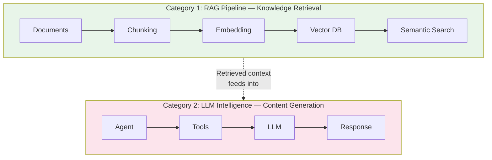
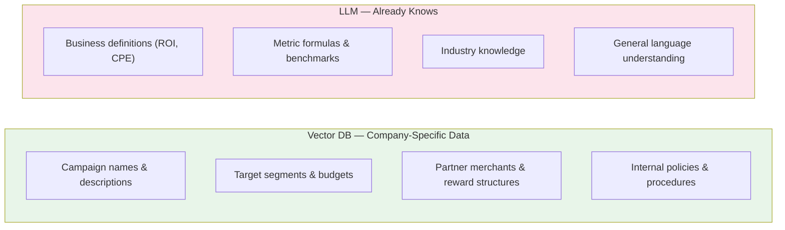
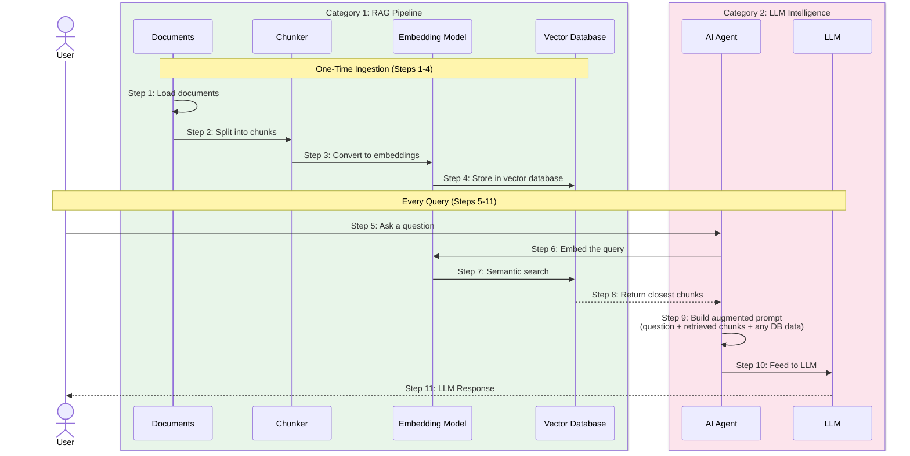
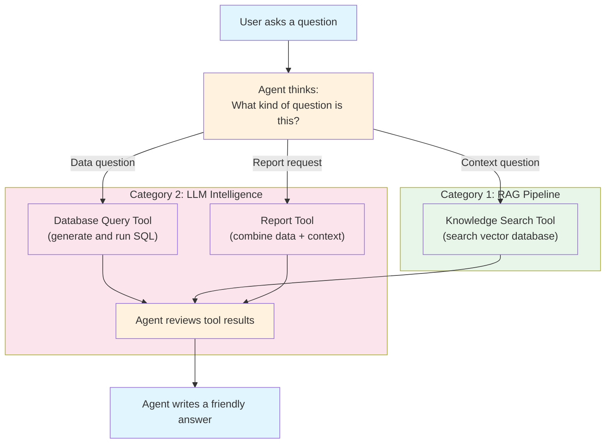
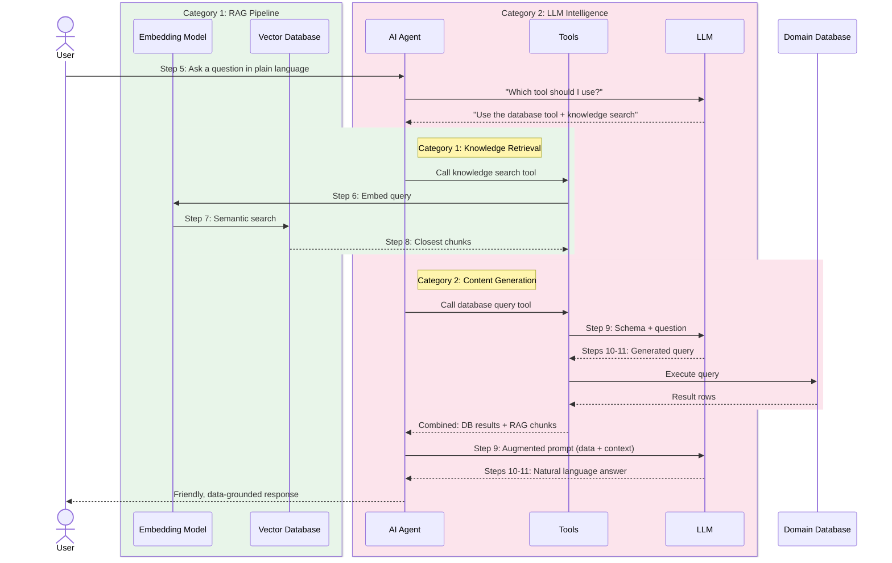

# TUTORIAL: AI Concepts for Beginners

A step-by-step guide to the core AI concepts used in modern AI-powered applications. No prior AI experience is needed. Concepts are explained generically — the accompanying `campaign_performance_analysis` project is referenced as a working example.

---

## Step 1: Understanding the Problem AI Solves

Imagine any team that needs to answer questions from data stored in databases — sales figures, inventory levels, patient records, marketing results. Traditionally, this requires:

1. A **data analyst** who knows SQL (a database query language)
2. A **domain expert** who understands the terminology
3. A **report writer** who can summarize findings in plain English

Modern AI can replace all three by letting users ask questions in plain English and getting answers automatically.

> **In our example project:** Business stakeholders ask questions like "Which campaign has the highest enrollment?" and the AI writes the SQL, runs it, and explains the results — no SQL knowledge needed.

---

## Step 2: The Two Categories of a RAG Application

Any RAG (Retrieval-Augmented Generation) application is built around two distinct categories:



**Category 1 (RAG Pipeline)** finds relevant information from your domain-specific knowledge base. It uses embedding models (NOT the LLM) to convert text into numerical vectors and search by meaning. This is the "retrieval" part.

**Category 2 (LLM Intelligence)** thinks, reasons, and generates natural language. The LLM decides which tools to use, generates structured queries, synthesizes data into reports, and can fall back on its own trained knowledge when the knowledge base has no relevant answer. This is the "generation" part.

### Why separate them?

- You can swap your vector database (e.g., ChromaDB → Pinecone) without touching any LLM code
- You can swap your LLM provider (e.g., Claude → GPT) without touching any retrieval code
- Each category can be tested, debugged, and scaled independently

> **In our example project:** The `rag/` package handles Category 1 (documents, chunking, ChromaDB). The `llm/` package handles Category 2 (Claude, agent, tools). They communicate through a clean interface — `search_similar()`.

---

## Step 3: LLM (Large Language Model) — The "Brain" (Category 2)

### What is an LLM?

> **Jargon: LLM (Large Language Model)** — An AI model trained on massive amounts of text that can understand and generate human language. "Large" refers to the billions of **parameters** (learned numbers) inside the model.

A Large Language Model is an AI that understands and generates human language. Think of it as a very smart auto-complete — but instead of finishing your sentence, it can write database queries, summarize data, and have multi-turn conversations.

### Popular LLMs

| LLM | Provider | Key Strength |
|-----|----------|-------------|
| **Claude** | Anthropic | Strong reasoning, tool use, long context |
| **GPT** | OpenAI | Broad ecosystem, multimodal |
| **Gemini** | Google | Multimodal, large context window |
| **LLaMA** | Meta | Open source, self-hostable |

### What can an LLM do in a RAG application?

1. **Convert natural language to structured queries** — "Show me top sellers" → `SELECT ... ORDER BY sales DESC`
2. **Synthesize multiple data sources** — combine database rows + knowledge base context into a coherent narrative
3. **Decide which tool to use** — "Is this a data question or a definition question?"
4. **Fall back on trained knowledge** — when your knowledge base doesn't have an answer, the LLM can provide general definitions from what it learned during training

### Key Configuration Parameters

> **Jargon: Token** — A unit of text the LLM processes. Roughly 1 token ≈ ¾ of a word. "Hello world" = 2 tokens. "Enrollment rate" = 2 tokens. Token limits control how much the LLM can read (context window) and write (max tokens).

> **Jargon: Temperature** — A number (0 to 1) that controls randomness. At `0`, the LLM always picks the most likely next word (deterministic — best for data queries). At `1`, it explores less likely words (creative — good for brainstorming).

> **Jargon: Inference** — When the LLM generates a response. This is the "running" phase (as opposed to the "training" phase when the model was built). Each API call is one inference.

| Parameter | What It Controls | Typical Value |
|-----------|-----------------|---------------|
| **Model** | Which LLM to use | `claude-sonnet-4-20250514` |
| **Temperature** | Creativity vs. precision (0 = deterministic, 1 = creative) | `0` for data queries |
| **Max Tokens** | Maximum length of the response | `1024`–`4096` |

### Simple Analogy

The LLM is like a very experienced analyst who speaks both "human language" and "database language." You tell it what you want in English, and it translates that into the right technical actions.

> **In our example project:** Claude is initialized in `llm/provider.py` with `temperature=0` (deterministic for data accuracy) and used by all three tools — SQL generation, RAG search formatting, and performance report synthesis.

---

## Step 4: RAG (Retrieval-Augmented Generation) — The "Reference Book" (Category 1)

### What is RAG?

> **Jargon: RAG (Retrieval-Augmented Generation)** — A technique where the AI first *retrieves* relevant information from a knowledge base, then *generates* an answer using that information. "Retrieval" = look it up. "Augmented" = enrich the prompt. "Generation" = LLM writes the answer.

RAG is a technique where the AI first *retrieves* relevant information from a knowledge base, and then *generates* an answer using that information. Without RAG, the AI only knows what it was trained on. With RAG, it can access your specific domain data.

### Why is RAG needed?

An LLM knows general things about the world, but it does NOT know your specific data — your company's products, your internal terminology, your policies, your metrics. RAG bridges this gap by giving the LLM a "reference book" to consult before answering.

### What should go in the vector DB vs. what the LLM already knows?



**Rule of thumb:** If the LLM could reasonably answer it without your data, don't put it in the vector DB. Only store what is unique to your organization.

### How RAG works — The 11-Step Pipeline

Every RAG application follows this same fundamental pipeline, regardless of domain:



### The 11 Steps Explained

| Step | Name | Category | What Happens |
|------|------|----------|--------------|
| 1 | Loading Documents | RAG | Domain documents gathered — could be PDFs, text files, database records, or hard-coded content |
| 2 | Chunking | RAG | Documents split into smaller overlapping pieces for better search precision |
| 3 | Embedding Chunks | RAG | Each chunk converted to a numerical vector (e.g., 384 dimensions) |
| 4 | Storing in Vector DB | RAG | Vectors stored in a vector database (e.g., ChromaDB, Pinecone, FAISS) with metadata |
| 5 | User Query | LLM | User asks a question; agent decides which tool(s) to call |
| 6 | Embedding Query | RAG | User's question converted to a vector using the same embedding model |
| 7 | Semantic Search | RAG | Find vectors closest to the query vector (cosine similarity) |
| 8 | Retrieve Chunks | RAG | Return the most relevant document chunks with distance scores |
| 9 | Augmented Prompt | LLM | Combine retrieved chunks + any structured data + original question into one prompt |
| 10 | Fed to LLM | LLM | Send the augmented prompt to the LLM |
| 11 | LLM Response | LLM | LLM generates a natural language answer grounded in the retrieved data |

> **In our example project:** Steps 1-4 happen at startup — campaign descriptions (company-specific data only) are chunked and stored in ChromaDB. Generic knowledge like business glossary definitions and performance analysis are NOT stored — the LLM already knows these. Steps 5-11 happen on every API request — the user's question triggers semantic search, SQL queries, and Claude synthesis.

### Simple Analogy

Imagine you are taking an open-book exam. The textbook is your knowledge base. RAG is the process of: (a) looking up the most relevant pages, then (b) writing your answer using those pages. Without RAG, it is a closed-book exam — you can only use what you memorized.

### What is Chunking? (Step 2)

> **Jargon: Chunking** — Splitting a large document into smaller, overlapping pieces before converting to vectors. Each chunk becomes one entry in the vector database. Smaller chunks = more precise retrieval.

Documents are split into smaller, overlapping pieces before embedding. Why?

- **Better retrieval** — A 200-character chunk specifically about "ROI calculation" is more relevant to an ROI question than a 2000-character document that mentions ROI in one sentence
- **Overlap** — Chunks overlap so no information is lost at boundaries
- **Configurable** — Chunk size and overlap are tunable parameters that affect retrieval quality

```
Original document (400 chars):
[==================================================]

After chunking (size=200, overlap=50):
[===================]           ← Chunk 1 (chars 0-200)
            [===================]     ← Chunk 2 (chars 150-350)
                        [===================]  ← Chunk 3 (chars 300-400)
```

Common chunking strategies:
- **RecursiveCharacterTextSplitter** (LangChain) — tries paragraph → sentence → word boundaries before character splits
- **TokenTextSplitter** — splits by token count (useful when you care about LLM token limits)
- **SemanticChunker** — uses embeddings to find natural topic boundaries

> **In our example project:** `rag/chunking.py` uses `RecursiveCharacterTextSplitter` with `chunk_size=200` and `chunk_overlap=50`, splitting at `["\n\n", "\n", ". ", ", ", " "]` boundaries.

### What is an Embedding?

> **Jargon: Embedding / Vector** — A list of numbers (typically 384 or 768) that represents the meaning of a chunk of text. Two chunks with similar meanings will have similar numbers, enabling search by meaning rather than exact keyword match.

> **Jargon: Sentence Transformer** — A small, fast AI model (e.g., `all-MiniLM-L6-v2`) that converts text into embeddings. NOT the same as the LLM. Runs locally on CPU, no API key needed, produces vectors in milliseconds.

An **embedding** is a list of numbers (a **vector**) that represents the *meaning* of an entire sentence or chunk — not individual words. The **sentence transformer** model reads all the words together and produces one single vector that captures the combined meaning.

```
"The dog chased the cat"    → [0.12, 0.85, -0.33, 0.67, ...]  (384 numbers)
"A canine pursued a feline" → [0.11, 0.84, -0.31, 0.68, ...]  (very similar!)
"Stock prices fell today"   → [-0.55, 0.12, 0.91, -0.23, ...]  (very different)
```

This is why **semantic search** works — "student credit card offers" would match a chunk about "targeting student cardholders with 10% cashback" even though those exact words don't appear, because the *meanings* are similar.

The embedding model (e.g., `all-MiniLM-L6-v2`) is a small, fast model — NOT the same as the LLM. It runs locally, has no API costs, and produces vectors in milliseconds.

### How a Chunk is Stored in the Vector Database

Each chunk is stored as a single entry with four fields:

```
┌─────────────────────────────────────────────────────────────────────┐
│ ID:       "desc_CMP-003_chunk0"                                     │
│ Document: "Spring Dining Deal: A dining rewards campaign targeting  │
│            student cardholders. Offers 10% cashback at partner      │
│            restaurants including Olive Garden and Starbucks."       │
│ Vector:   [0.042, -0.118, 0.231, 0.067, ..., -0.089]  (384 nums)  │
│ Metadata: {type: "campaign_description", campaign_id: "CMP-003",   │
│            chunk_index: 0, total_chunks: 2}                         │
└─────────────────────────────────────────────────────────────────────┘
```

- **Document** — the original chunk text (stored as-is for retrieval)
- **Vector** — the embedding (384 numbers representing the meaning of the entire chunk)
- **Metadata** — structured tags for filtering (type, campaign ID, chunk position)

> **Important:** The vector represents the meaning of the **whole sentence/chunk**, not individual words. This is different from older approaches like Word2Vec where each word got its own vector. Modern sentence transformers capture relationships between words — e.g., "not good" produces a very different vector from "good".

### Key Terms

> **Jargon: Vector Database** — A specialized database that stores embeddings (vectors) and finds the "most similar" items by meaning. Unlike a regular database (which searches by exact match), a vector DB answers "what is closest in meaning to this query?"

> **Jargon: Cosine Similarity** — The math formula used to measure how similar two vectors are. Returns a score from 0 (completely unrelated) to 1 (identical meaning). In ChromaDB, results are returned as **distance** (lower = more similar).

> **Jargon: Semantic Search** — Searching by meaning rather than exact keywords. "student credit card offers" finds "targeting student cardholders with 10% cashback" because the meanings are similar, even though the words are different.

| Term | Simple Definition |
|------|------------------|
| **Embedding / Vector** | A list of numbers representing the meaning of a text chunk. Similar texts → similar numbers. |
| **Vector Database** | A database that stores embeddings and finds "most similar" items by meaning. |
| **Sentence Transformer** | A small AI model that converts text into embeddings. Runs locally, no API needed. |
| **Chunking** | Splitting documents into smaller overlapping pieces for more precise retrieval. |
| **Cosine Similarity / Distance** | A measure of how similar two vectors are. Lower distance = more similar meaning. |
| **Semantic Search** | Searching by meaning, not exact keywords. Powered by embeddings + cosine similarity. |

### Common Vector Databases

| Database | Key Feature | Best For |
|----------|------------|----------|
| **ChromaDB** | Lightweight, runs locally, no server | Prototypes, small-medium datasets |
| **Pinecone** | Cloud-hosted, fully managed | Production at scale |
| **Weaviate** | Open source, feature-rich | Self-hosted production |
| **FAISS** | By Meta, optimized for speed | Large-scale similarity search |
| **Milvus** | Open source, distributed | Enterprise deployments |

---

## Step 5: AI Agent — The "Decision Maker" (Category 2)

### What is an AI Agent?

> **Jargon: AI Agent** — An LLM that can *use tools* and *make decisions*. Unlike a simple chatbot (which just replies), an agent can take actions — run database queries, search documents, call APIs. It reasons about *what* to do, then *does* it.

> **Jargon: Tool Calling / Function Calling** — When the LLM decides to invoke a specific function (tool) instead of just generating text. The LLM outputs a structured request like "call sql_query_tool with question='Which campaign has the highest ROI?'" and the framework executes it.

An AI Agent is an LLM that can *use tools* and *make decisions* about which tool to use. Instead of just chatting, it can take actions — query a database, search a knowledge base, call an API, or generate a report.

The key difference from a simple chatbot:
- **Chatbot:** You ask → it answers from its training data
- **Agent:** You ask → it *thinks* about what it needs → *calls tools* → *reviews results* → answers

### How an Agent works



1. User asks a question
2. The agent (powered by the LLM) analyzes what kind of question it is
3. It decides which tool is best suited and calls it
4. The tool executes (runs a query, searches documents, calls an API, etc.)
5. The agent reviews the tool's output
6. It writes a final, human-readable answer

### The ReAct Pattern (Reason + Act)

> **Jargon: ReAct (Reason + Act)** — A design pattern where the agent alternates between thinking ("I need data from the database") and acting (calling the SQL tool). This loop repeats until the agent has enough information to answer.

Most modern agents use the **ReAct** pattern — the LLM alternates between:
- **Reasoning:** "This question asks for data, I should use the SQL tool"
- **Acting:** Calls the SQL tool with the question
- **Observing:** Reads the tool's output
- **Reasoning again:** "I have the data, now I can answer"

This loop continues until the agent has enough information to respond.

### What are Tools?

Tools are regular functions that the agent can call. Each tool has:
- A **name** — so the agent can refer to it
- A **description** (from the docstring) — so the agent knows *when* to use it
- **Parameters** — what inputs it needs
- A **return value** — what it gives back

In LangChain, you define a tool with the `@tool` decorator:

```python
from langchain_core.tools import tool

@tool
def search_knowledge_base(query: str) -> str:
    """Search the knowledge base for relevant context.
    Use when the user asks about definitions or qualitative information."""
    results = vector_store.search(query)
    return format_results(results)
```

The docstring is critical — it's what the LLM reads to decide whether to use this tool.

> **In our example project:** Three tools are defined in `llm/tools/` — `sql_query_tool` (generates and runs SQL), `rag_search_tool` (searches ChromaDB for campaign descriptions), and `performance_summary_tool` (fetches raw SQL data + campaign context from RAG, then Claude computes metrics and writes the report).

### Simple Analogy

The agent is like a manager with several employees (tools). When you give the manager a task, they decide which employee is best suited, delegate the work, review the result, and report back to you. The manager can even ask multiple employees for help on complex questions.

### Common Agent Frameworks

| Framework | Key Feature | Pattern |
|-----------|------------|---------|
| **LangChain + LangGraph** | Most popular, stateful graph-based agents | ReAct with message state |
| **LlamaIndex** | Optimized for RAG-heavy workflows | Query engines + tools |
| **CrewAI** | Multi-agent collaboration | Role-based agent teams |
| **AutoGen** | Microsoft's framework | Conversational agent groups |

> **In our example project:** `llm/agent.py` uses LangGraph's `create_react_agent()` which implements the ReAct pattern. The agent maintains conversation history via LangGraph's built-in message state.

---

## Step 6: LLM Fallback — When RAG Has No Answer

An important behavior: what happens when the user asks something NOT in your knowledge base?

```
User: "What is the definition of enrollment and what are its types?"
```

Your vector database might have "Enrollment Rate: The percentage of users who enroll..." but NOT a general definition of enrollment or its types. In this case:

1. **RAG search returns weak matches** — campaign descriptions that mention "enrollment" but don't define it
2. **The LLM provides the definition** — Claude knows what enrollment means from its training data
3. **The answer blends both** — company-specific context from RAG + general knowledge from the LLM

This is a key advantage of the two-category architecture. Category 1 (RAG) provides what it can; Category 2 (LLM) supplements with its broader trained knowledge. The user gets a complete answer either way.

> **In our example project:** The Postman collection Case 1 demonstrates this — asking about enrollment types. The vector DB only has campaign descriptions, so Claude provides the definition from its own trained knowledge.

---

## Step 7: Putting It All Together

Here is how the two categories combine into a complete application:



### The key insight

Each component has a clear role, mapped to two categories:

**Category 1 (RAG Pipeline):** Finds relevant information
- **Embedding Model** = converts text to numerical vectors (runs locally, no API cost)
- **Vector Database** = stores and searches by meaning
- **Chunker** = splits documents for precise retrieval

**Category 2 (LLM Intelligence):** Thinks and generates
- **LLM** = understands language, generates queries and text
- **Agent** = decides what actions to take and coordinates everything
- **Tools** = specialized functions the agent can call

---

## Step 8: Common Patterns Across RAG Applications

Regardless of the domain (healthcare, finance, e-commerce, legal), every RAG application uses these same patterns:

### Pattern: Hybrid Retrieval

Combining vector search (semantic) with structured queries (SQL/API) gives the best results. Vector search finds *context*; structured queries find *data*.

### Pattern: Augmented Prompt Assembly

> **Jargon: Augmented Prompt** — The final prompt sent to the LLM, enriched with retrieved data (from RAG and/or SQL) before the LLM sees it. "Augmented" = the original question plus all the context the LLM needs to give a grounded answer.

> **Jargon: Context Window** — The maximum amount of text the LLM can "see" at once (e.g., 200K tokens for Claude). The augmented prompt + the response must fit within this window. Chunking keeps documents small so they fit.

The most critical step. The prompt sent to the LLM typically looks like:

```
Given the following context:
[Retrieved chunks from vector DB]
[Results from database query]

Answer the following question:
[User's original question]
```

The quality of this prompt directly determines the quality of the answer.

### Pattern: Safety Guards

Always validate LLM-generated queries before executing them. The LLM might generate a `DROP TABLE` or `DELETE` statement. A regex or allowlist guard prevents this.

### Pattern: Idempotent Initialization

The knowledge base should only be built once. On subsequent startups, check if data already exists and skip re-ingestion.

> **In our example project:** All four patterns are implemented — hybrid retrieval (SQL + ChromaDB), augmented prompts (in `performance_summary_tool`), SQL safety guards (regex in `campaign_db.py`), and idempotent init (ChromaDB count check in `vector_store.py`).

---

## Glossary of AI Terms

| Term | Simple Definition |
|------|------------------|
| **LLM** | An AI model that reads and writes human language |
| **RAG** | A technique: look up relevant info first, then answer |
| **Embedding** | Numbers that represent the meaning of text |
| **Vector Database** | A database that finds similar items by meaning |
| **Chunking** | Splitting documents into smaller overlapping pieces for better search |
| **Cosine Similarity** | A measure of how similar two vectors are (0 = unrelated, 1 = identical) |
| **Agent** | An AI that can decide which tools to use and take actions |
| **ReAct** | A pattern where the agent alternates between reasoning and acting |
| **Tool Calling** | When the AI decides to run a specific function (like a database query) |
| **Prompt** | The instruction/question you give to the AI |
| **Augmented Prompt** | A prompt enriched with retrieved context and data before sending to LLM |
| **Token** | A unit of text (roughly a word or part of a word) |
| **Temperature** | Controls randomness: 0 = deterministic, 1 = creative |
| **Context Window** | How much text the AI can "see" at once (e.g., 200K tokens for Claude) |
| **Fine-tuning** | Training an existing LLM on your specific data |
| **Inference** | When the LLM generates a response (as opposed to training) |
| **Sentence Transformer** | A small model that converts text to embeddings. Runs locally, no API cost. |
