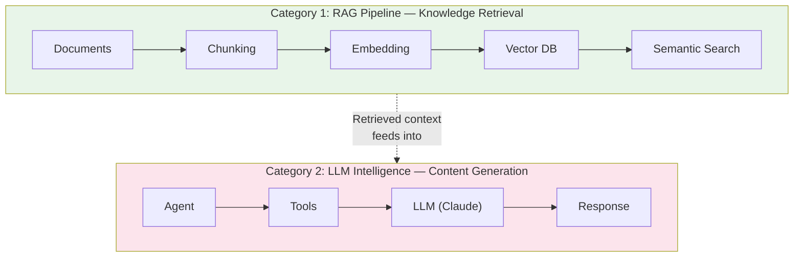
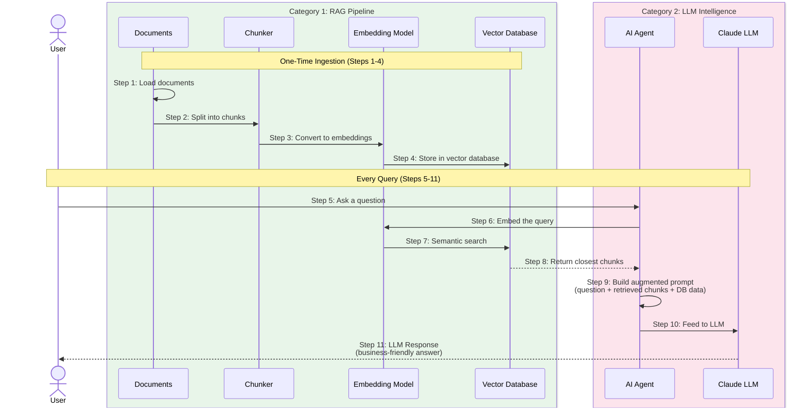
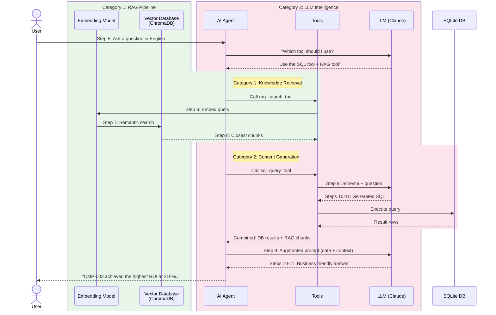

# TUTORIAL: AI Concepts for Beginners

A step-by-step guide to the core AI concepts used in modern AI-powered applications. No prior AI experience is needed.

---

## Step 1: Understanding the Problem AI Solves

Imagine a business team that needs to answer questions from data stored in databases. Traditionally, this requires:

1. A **data analyst** who knows SQL (a database query language)
2. A **domain expert** who understands the business terminology
3. A **report writer** who can summarize findings in plain English

Modern AI can replace all three by letting users ask questions in plain English and getting answers automatically.

---

## Step 2: The Two Categories of a RAG Application

A modern RAG (Retrieval-Augmented Generation) application is built around two distinct categories:



**Category 1 (RAG Pipeline)** finds relevant information from your domain-specific knowledge base. It uses embedding models (NOT the LLM) to convert text into numerical vectors and search by meaning.

**Category 2 (LLM Intelligence)** thinks, reasons, and generates natural language. Claude decides which tools to use, generates SQL queries, synthesizes data into reports, and can fall back on its own trained knowledge when the knowledge base has no relevant answer.

---

## Step 3: LLM (Large Language Model) — The "Brain" (Category 2)

### What is an LLM?

A Large Language Model (LLM) is an AI that understands and generates human language. Think of it as a very smart auto-complete — but instead of finishing your sentence, it can write database queries, summarize data, and have multi-turn conversations.

### Popular LLMs

- **Claude** by Anthropic
- **GPT** by OpenAI
- **Gemini** by Google
- **LLaMA** by Meta (open source)

### What can an LLM do?

- Convert English questions into SQL database queries
- Read query results and explain them in plain English
- Generate summary reports
- Decide which tool to use for a given question
- Provide general knowledge when domain-specific data is missing

### Simple Analogy

The LLM is like a very experienced business analyst who speaks both "human language" and "database language." You tell it what you want in English, and it translates that into the right technical actions.

### Key Configuration Parameters

| Parameter | What It Controls | Example |
|-----------|-----------------|---------|
| **Model** | Which LLM to use | `claude-sonnet-4-20250514` |
| **Temperature** | Creativity vs. precision (0 = precise, 1 = creative) | `0` for data queries |
| **Max Tokens** | Maximum length of the response | `2048` |

---

## Step 4: RAG (Retrieval-Augmented Generation) — The "Reference Book" (Category 1)

### What is RAG?

RAG is a technique where the AI first *retrieves* relevant information from a knowledge base, and then *generates* an answer using that information. Without RAG, the AI only knows what it was trained on. With RAG, it can access your specific business data.

### Why is RAG needed?

An LLM knows general things about the world, but it does NOT know your specific business data — like "Campaign X targets student customers" or "redemption rate means the percentage of enrolled customers who use their reward." RAG bridges this gap.

### How RAG works — The 11-Step Pipeline



### The 11 Steps Explained

| Step | Name | Category | What Happens |
|------|------|----------|--------------|
| 1 | Loading Documents | RAG | Business documents gathered (descriptions, summaries, glossary) |
| 2 | Chunking | RAG | Documents split into smaller overlapping pieces for better search |
| 3 | Embedding Chunks | RAG | Each chunk converted to a numerical vector (384 dimensions) |
| 4 | Storing in Vector DB | RAG | Vectors stored in ChromaDB with metadata |
| 5 | User Query | LLM | User asks a question, agent decides which tools to call |
| 6 | Embedding Query | RAG | User's question converted to a vector using same model |
| 7 | Semantic Search | RAG | Find vectors closest to the query (cosine similarity) |
| 8 | Retrieve Chunks | RAG | Return the most relevant document chunks |
| 9 | Augmented Prompt | LLM | Combine retrieved chunks + DB results + question into one prompt |
| 10 | Fed to LLM | LLM | Send the augmented prompt to Claude |
| 11 | LLM Response | LLM | Claude generates a natural language answer grounded in data |

### Simple Analogy

Imagine you are taking an open-book exam. The textbook is your knowledge base. RAG is the process of: (a) looking up the most relevant pages, then (b) writing your answer using those pages. Without RAG, it is a closed-book exam — you can only use what you memorized.

### What is Chunking? (Step 2)

Documents are split into smaller, overlapping pieces before embedding. Why?

- **Better retrieval** — A 200-character chunk about "ROI calculation" is more relevant to an ROI question than a 2000-character document that mentions ROI in one sentence
- **Overlap** — Chunks overlap by ~50 characters so no information is lost at boundaries
- **Configurable** — Chunk size and overlap are tunable parameters

```
Original document (400 chars):
[==================================================]

After chunking (size=200, overlap=50):
[===================]           ← Chunk 1 (chars 0-200)
            [===================]     ← Chunk 2 (chars 150-350)
                        [===================]  ← Chunk 3 (chars 300-400)
```

### Key Terms

| Term | Simple Definition |
|------|------------------|
| **Embedding** | A list of numbers that represents the *meaning* of a text. Similar texts have similar numbers. This is how the computer "understands" similarity. |
| **Vector Database** | A specialized database that stores embeddings and can quickly find "most similar" items. Think of it as a smart filing cabinet that organizes by meaning, not alphabetical order. |
| **Sentence Transformer** | A small AI model that converts text into embeddings. Popular choice: `all-MiniLM-L6-v2`. |
| **Chunking** | Splitting documents into smaller pieces for more precise retrieval. |

### Common Vector Databases

| Database | Key Feature |
|----------|------------|
| **ChromaDB** | Lightweight, runs locally, no server needed |
| **Pinecone** | Cloud-hosted, scalable |
| **Weaviate** | Open source, feature-rich |
| **FAISS** | By Meta, optimized for speed |

---

## Step 5: AI Agent — The "Decision Maker" (Category 2)

### What is an AI Agent?

An AI Agent is an LLM that can *use tools* and *make decisions* about which tool to use. Instead of just chatting, it can take actions — query a database, search a knowledge base, or generate a report.

### How an Agent works


1. You ask a question
2. The agent (powered by the LLM) analyzes what kind of question it is
3. It decides which tool is best suited and calls it
4. The tool executes (runs a query, searches documents, etc.)
5. The agent reviews the tool's output
6. It writes a final, human-readable answer

### Simple Analogy

The agent is like a manager with several employees (tools). When you give the manager a task, they decide which employee is best suited, delegate the work, review the result, and report back to you. The manager can even ask multiple employees for help on complex questions.

### Common Agent Frameworks

| Framework | Key Feature |
|-----------|------------|
| **LangChain + LangGraph** | Most popular, supports react agents with stateful graphs |
| **LlamaIndex** | Optimized for RAG workflows |
| **CrewAI** | Multi-agent collaboration |
| **AutoGen** | Microsoft's agent framework |

---

## Step 6: Putting It All Together

Here is how the two categories combine into a complete AI application:



### The key insight

Each component has a clear role, mapped to two categories:

**Category 1 (RAG Pipeline):** Finds relevant information
- **Embedding Model** = converts text to numerical vectors
- **Vector Database** = stores and searches by meaning
- **Chunker** = splits documents for precise retrieval

**Category 2 (LLM Intelligence):** Thinks and generates
- **LLM** = understands language, generates SQL and text
- **Agent** = decides what actions to take and coordinates everything
- **Tools** = specialized functions the agent can call

---

## Glossary of AI Terms

| Term | Simple Definition |
|------|------------------|
| **LLM** | An AI model that reads and writes human language |
| **RAG** | A technique: look up relevant info first, then answer |
| **Embedding** | Numbers that represent the meaning of text |
| **Vector Database** | A database that finds similar items by meaning |
| **Chunking** | Splitting documents into smaller overlapping pieces for better search |
| **Agent** | An AI that can decide which tools to use and take actions |
| **Tool Calling** | When the AI decides to run a specific function (like a SQL query) |
| **Prompt** | The instruction/question you give to the AI |
| **Augmented Prompt** | A prompt enriched with retrieved context and data before sending to LLM |
| **Token** | A unit of text (roughly a word or part of a word) |
| **Temperature** | Controls randomness: 0 = deterministic, 1 = creative |
| **Context Window** | How much text the AI can "see" at once (e.g., 200K tokens) |
| **Fine-tuning** | Training an existing LLM on your specific data |
| **Inference** | When the LLM generates a response (as opposed to training) |
